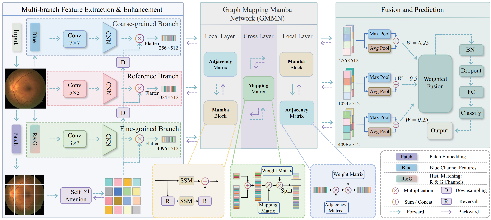

# GMMN
Graph mapping Mamba network for automated macular edema diagnosis from fundus images

## 🌟 Introduction

This project explores the combination of **Mamba** and **Graph Convolutional Networks (GCN)** for image analysis tasks. The integration of these two architectures represents a mutually beneficial design: Mamba contributes its strong capability for capturing **long-range dependencies**, which GCNs typically lack, while GCNs complement Mamba by enhancing **local connectivity modeling**, which Mamba may underexploit in visual tasks.

Moreover, both Mamba and GCN are inherently designed to process **1D sequential data**, which enables image representation and reasoning without the need for excessive 2D unfolding or complex restructuring. This synergy not only simplifies the data pipeline but also improves model efficiency and interpretability for image understanding tasks.


## 🔍Abstract

Macular edema is a retinal disease that severely impairs vision, necessitating timely and accurate automated diagnosis for effective clinical treatment. However, its subtle manifestations in color fundus photography (CFP) images pose significant challenges for deep learning methods in modeling and analyzing pathological features. To address this issue, we propose a Graph Mapping Mamba Network (GMMN) that integrates Graph Convolutional Networks (GCNs) with Mamba to enhance feature modeling and improve diagnostic performance. GMMN leverages GCNs for feature encoding to capture local spatial correlations while utilizing Mamba to model long-range dependencies, thereby enhancing global feature representation. Compared with existing Mamba-based image processing methods, GMMN compensates for Mamba’s limitations in local feature modeling through GCNs and mitigates the redundancy caused by multi-directional scanning. Additionally, we introduce a mapping matrix to exploit geometric correspondences across branches, enabling efficient cross-layer feature fusion. Furthermore, to optimize the extraction of macular edema features, we design a multi-branch, multi-scale feature extraction method that leverages the spectral reflectance variations of macular edema at different wavelengths. This ensures that the extracted features align more closely with the pathological characteristics of the affected regions, providing more discriminative inputs for subsequent GMMN processing. Experimental results demonstrate that our proposed method outperforms existing approaches on the IDRiD, Messidor, and a proprietary clinical dataset, validating the potential of integrating GCNs and Mamba for medical image analysis.
## 🧠 Framework Overview

<p align="center">
  
</p>

<p align="center">
  <em>Figure: Overall architecture of the proposed GMMN framework combining Mamba and GCN for retinal image analysis.</em>
</p>

## 🔧 Installation

This codebase was tested with the following environment settings, though it may work with other compatible versions:

- **OS**: Ubuntu 22.04  
- **CUDA**: 11.8+  
- **Python**: 3.11+  
- **PyTorch**: 2.6+

To enable selective scan with efficient hardware design, install the following libraries:

```
pip install causal_conv1d
pip install mamba_ssm
```

You can also create a clean conda environment and install all required packages with a
```
conda install --yes --file requirements.txt
```
